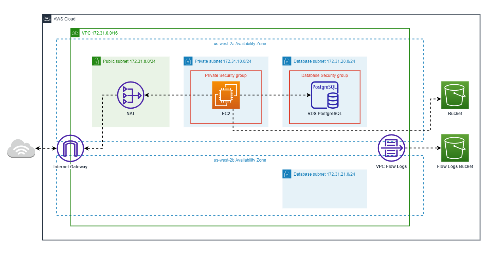

# AWS Terraform Template

## Default Architecture


This template comes with an example under `production/` and `staging/` directories.

### Features:
- VPC, Subnets (public, private, database)
- Security Groups for private (EC2) instances, database (RDS), public* instances.
- NAT and Internet Gateway
- EC2 Instance
- Single AZ, RDS PostgreSQL instance. However, there are two database subnets and availability zones to support Multi-AZ DB deployment, [as required by AWS](https://docs.amazonaws.cn/en_us/AmazonRDS/latest/UserGuide/CHAP_Tutorials.WebServerDB.CreateVPC.html#:~:text=Amazon%20RDS%20requires%20at%20least%20two%20subnets%20in%20two%20different%20Availability%20Zones%20to%20support%20Multi%2DAZ%20DB%20instance%20deployments.%20This%20tutorial%20creates%20a%20Single%2DAZ%20deployment%2C%20but%20the%20requirement%20makes%20it%20easier%20to%20convert%20to%20a%20Multi%2DAZ%20DB%20instance%20deployment%20in%20the%20future.).
- S3 Buckets for object storage and VPC flow logs.

*Since there are no public instances, the public security group is not shown in the diagram. But it is there if you need it.

## Prerequisites

1. [Terraform CLI](https://www.terraform.io/downloads)
2. [AWS CLI](https://docs.aws.amazon.com/cli/latest/userguide/getting-started-install.html)
3. [AWS Access Key](https://docs.aws.amazon.com/IAM/latest/UserGuide/id_credentials_access-keys.html): Access key credentials must come from IAM user with the following permissions attached to a policy to create the backend resources:
    - s3:CreateBucket
    - s3:PutBucketVersioning
    - s3:PutBucketPublicAccessBlock
    - dynamodb:CreateTable
    - iam:CreateRole
    - iam:UpdateAssumeRolePolicy
4. [direnv](https://direnv.net/docs/installation.html)


## Initial Setup
1. In `.envrc`, set the initial backend resources and AWS profile details for `staging` and `production`. If you don't have one yet, use `.envrc.example` as a format. To create it, run:
    ```
    cp .envrc.example .envrc
    ```
    Export the variables from `.envrc`:
    ```
    direnv allow
    ```
    Edit the `staging` and `production` variables of `.envrc`.
    ```
    # Staging
    export TF_STAGING_PROFILE_NAME=staging-account
    export TF_STAGING_BUCKET_NAME=dpd-de-sandbox-tf-state-staging
    export TF_STAGING_DYNAMODB_TABLE_NAME=dwh-terraform-lock-staging
    export TF_STAGING_REGION=us-west-2
    # Production
    ...
    ```
2. Once set, run the commands below to configure AWS Credentials and to create the initial backend S3 and DynamoDB storage.
    ```bash
    make staging -f terraform.mk
    # OR
    make production -f terraform.mk
    ```
    You will be asked to input your AWS credentials for your staging/production account. Set the Default region name to the region defined in terraform.mk.

    ```bash
    you@TM-LAPTOP:~/dwt-terraform-template/aws$ make staging
    aws configure --profile staging-account
    AWS Access Key ID: # Your AWS Account Access Key ID
    AWS Secret Access Key: # Your AWS Secret Access Key
    Default region name [None]: # Use the same region defined in terraform.mk
    Default output format [None]: # You can leave this blank
    ```

3. Go to `staging` or `production` directory. 
    ```bash
    cd staging
    # OR
    cd production
    ```
4. Check the `bucket`, `region`, `dynamodb_table`, and `profile` in `backend.tf` if it contains the correct values based on `aws/terraform.mk`.
    ```hcl
    # backend.tf

    terraform {
    backend "s3" {
        encrypt        = true
        bucket         = <BUCKET_NAME>
        key            = "aws/terraform.tfstate"
        region         = <REGION>
        dynamodb_table = <DYNAMODB_TABLE_NAME>
        profile        = <PROFILE_NAME>
    }
    }
    ```

5. Check the `assume_role` block in `providers.tf` if it contains the correct values based on `aws/terraform.mk`
  ```hcl
  terraform {
    required_providers {
      aws = {
        source  = "hashicorp/aws"
        version = "~> 4.31"
      }

      postgresql = {
        source  = "cyrilgdn/postgresql"
        version = "1.13.0"
      }
    }

    required_version = ">= 0.14.9"
  }

  provider "aws" {
    profile = var.profile
    region  = var.region

    assume_role {
      role_arn = <TERRAFORM_ROLE_ARN}>
    }
  }
  ```

6. Create a `terraform.tfvars` file based on the `terraform.tfvars.sample` file. Once created, update `terraform.tfvars` with your desired values.
    ```bash
    cp terraform.tfvars.sample terraform.tfvars
    ```
    In `terraform.tfvars`, make sure to set `profile` with the proper AWS profile name, `environment` with the correct environment (staging or production), and the correct `region`.
    ```
    # terraform.tfvars

    # Global Config
    region = "us-west-2"
    tag_creator = "TM"
    profile = "staging-account"
    environment = "staging"
    ```

7. Initialize and create the resources on Terraform

    ```bash
    $ terraform init # DO THIS FIRST, initialize directory, pull down providers
    $ terraform validate # Check whether the configuration is valid
    $ terraform fmt # Reformat your configuration in the standard style
    $ terraform plan # Show changes required by the current configuration
    $ terraform apply # Create or update infrastructure
    $ terraform destroy # Destroy previously-created infrastructure
    ```

## EC2 instance access (via Session Manager)
Using [Session Manager](https://docs.aws.amazon.com/systems-manager/latest/userguide/session-manager.html), a capability of AWS Systems Manager, users can have SSH-like access to their EC2 instances. This works regardless of if the instance is running in a public or private subnet. This removes the need to manage SSH keys, bastion hosts, and the like.

The template is designed to pre-configure Session Manager access to its EC2 instances. This is done through assigning `AmazonSSMManagedInstanceCore` to the EC2's permissions and using an AMI with the SSM agent preinstalled ([documentation](https://docs.aws.amazon.com/systems-manager/latest/userguide/session-manager-prerequisites.html)).

Before proceeding, ensure that you have applied the Terraform configuration through `terraform apply`. Validate through the AWS console that the EC2 instance(s) are running and healthy.

### Launch EC2 session (via AWS CLI)
1. Ensure that you have installed [AWS CLI](https://docs.aws.amazon.com/cli/latest/userguide/getting-started-install.html) with the [Session Manager Plugin](https://docs.aws.amazon.com/systems-manager/latest/userguide/session-manager-working-with-install-plugin.html).

2. Save your instance ID from the EC2 instances page on the console. If your instance has a unique tag, you can also query its ID via the below command
```
aws ec2 describe-instances \
               --filter "Name=tag:<tag-name>,Values=<tag-value>" \
               --query "Reservations[].Instances[?State.Name == 'running'].InstanceId[]" \
               --output text \
               --profile $TF_STAGING_PROFILE_NAME
```

3. Use the below command to launch a session in your instance.
```
aws ssm start-session \
    --target <instance-id> \
    --profile $TF_STAGING_PROFILE_NAME
```

4. If needed, you can also forward any port from your instance so you can access it from `localhost`. In this case, below is the launch command.
```
aws ssm start-session \ 
                  --target <instance-id> \
                  --document-name AWS-StartPortForwardingSession \
                  --parameters '{"portNumber":["<port-on-EC2>"],"localPortNumber":["<port-on-localhost>"]}' \
                  --profile $TF_STAGING_PROFILE_NAME
```

### (Alternative) Launch EC2 session (via console)
1. In the EC2 instances page, select the instance and choose Connect.

2. Select the Session Manager tab. Ensure that the Connect button is enabled. If it is not enabled, either the instance has just booted and is establishing connection or it cannot access the Systems Manager endpoints.

3. Choose Connect. A separate page should load with a terminal shell for your EC2 instance.

## Clean-up
1. Remove the resources created using Terraform.
    ```
    $ terraform destroy # Destroy previously-created infrastructure
    ```

**WARNING**: The above command will destroy all resources **including all objects in your S3 buckets**. Make sure to back these up before running! 

2. Remove the backend resources.
    ```
    make destroy_staging_backend -f terraform.mk
    make destroy_prod_backend -f terraform.mk
    ```
